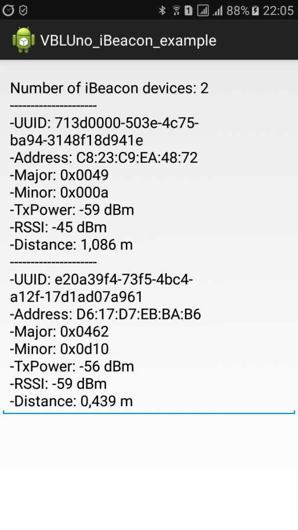

# Android iBeacon example

* Reference example: [android-beacon-library-reference](https://github.com/AltBeacon/android-beacon-library-reference)

* Library: [android-beacon-library](https://github.com/AltBeacon/android-beacon-library)

* Description:

	* IDE: Android Studio 2.2.2

	* Gradle: 2.14
 
	* In this project directory, edit local.properties, and give it a line that specifies the path to your Android SDK. (e.g. sdk.dir=/Applications/Android Studio.app/sdk)

* Beacon device: You can use the VBLUno51 board of VNG IoT Lab
	
	* Product page: http://iotviet.com.vn/store/detail?id=2

	* Wiki page: https://vngiotlab.github.io/vbluno/

	* Beacon example code for Arduino at [HERE](https://github.com/VNGIoTLab/vbluno/tree/master/code_examples/arduino/ex4_beacon) 

	* Demo video at [HERE](https://www.youtube.com/watch?v=vYMvAAsFJ2A&t=32s)

